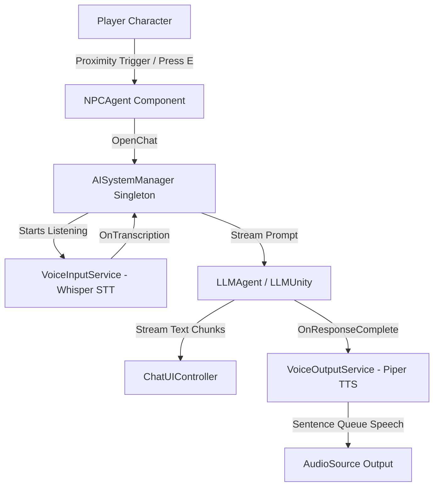

# 🤖 Unity Local AI-Driven NPCs

[](https://unity.com/)
[](LICENSE)
[](https://unity.com/)
[](https://github.com/oguzhan00yildiz/Unity-Local-AI-Driven-NPCs)
[](AIPackageInstaller/package.json)

A plug-and-play, **100% on-device AI NPC system** for Unity. Bring Non-Player Characters to life with real-time **voice-to-voice interaction** — powered locally by Large Language Models (LLM), Speech-to-Text (STT), and Neural Text-to-Speech (TTS).

> 🔒 **100% Local & Private**: Zero cloud APIs, no monthly subscriptions, zero network latency, and complete privacy — nothing ever leaves the player's computer.

---

## 🌟 Key Features

- 💬 **Local LLMs on CPU/GPU**: Powered by [LLMUnity](https://github.com/undreamai/LLMUnity) (llama.cpp) supporting GGUF models (**Qwen 3.5**, **Llama 3**, **Mistral**, **Phi-3**, etc.) with multi-layer GPU offloading.
- 🎙️ **Real-Time Speech Recognition (STT)**: High-speed local voice input via [Whisper Unity](https://github.com/Macoron/whisper.unity) with real-time Voice Activity Detection (VAD) and silence detection.
- 🗣️ **Neural Text-to-Speech (TTS)**: Natural voice synthesis using [Piper TTS](https://github.com/lookbe/piper-no-espeak-unity) with multiple distinct character voices (e.g., Amy, Ibrahim, Jenny, Ryan).
- 🎭 **ScriptableObject Personality Presets**: Configure NPC identity, backstory, prompt constraints, and voice presets in one click without touching code.
- ⚡ **One-Click Package Installer & Model Bootstrapper**: Automated dependency resolution, NPM ONNX Runtime configuration, and background model downloader window (~765 MB total).
- 🎯 **Modular Zero-Wiring Architecture**: Pure decoupled services (`AISystemManager`, `VoiceInputService`, `VoiceOutputService`, `NPCAgent`) that auto-bind at runtime.
- 🎮 **Universal Input Support**: Seamlessly works with both the **New Input System** and the **Legacy Input Manager**.

---

## ⚡ 1-Click Quick Setup (Install in Any Unity Project)

You can add this entire framework to any new or existing Unity project in seconds:

### 1. Add Package via Git URL
1. In Unity, open **Window → Package Manager**.
2. Click **+** (top-left) → **Add package from git URL…**
3. Paste:
   ```text
   https://github.com/oguzhan00yildiz/Unity-Local-AI-Driven-NPCs.git?path=AIPackageInstaller
   ```
4. Click **Add**.

```
[AI Package Installer] Initializing…
[AI Package Installer] manifest.json patched (NPM ONNX registry added).
[AI Package Installer] Installing: LLMUnity, Piper TTS, Whisper STT…
[AI Package Installer] ✅ All AI packages installed successfully!
```

> ⚠️ **Important:** Keep the Unity Editor open and in focus during package installation and model setup. Switching to other applications can cause Unity to throttle background execution, which can interrupt LLM native server configuration and model downloads.

### 2. Automatic Model Downloads
Once packages are resolved, the **AI System Setup Window** automatically downloads and configures the required local models:

| Component | Model / Asset | Size | Purpose |
| :--- | :--- | :--- | :--- |
| **STT** | `Whisper/ggml-tiny.bin` | 74 MB | Fast speech-to-text recognition |
| **TTS Core** | `PiperTTS/model.onnx` + dicts | 70 MB | Phonemizer & tokenizer |
| **Voices** | `Amy (Female)` & `Ibrahim (Male)` | ~122 MB | High-quality neural voice models |
| **LLM** | `Qwen3.5-0.8B-Q4_K_M.gguf` | 500 MB | Fast & smart on-device language model |

*(All models are saved to `Assets/StreamingAssets/` and auto-assigned to prefabs).*

> **Default LLM Model:** `Qwen3.5-0.8B-Q4_K_M.gguf` (~500 MB) is preconfigured out of the box. It offers high-speed on-device generation with minimal resource usage.

#### 🔄 How to Try Different LLM Models or Add a Custom Model
1. In your scene hierarchy, expand the `AISystem` prefab and select the **`LLM`** GameObject.
2. In the Inspector, locate the **`LLM`** component.
3. Click the **Model** dropdown:
   - **Download Presets:** Download popular models directly in Unity (Llama 3, Mistral, Gemma, Phi-3, etc.).
   - **Custom Model:** Select or drag & drop any `.gguf` file stored on your PC or inside `Assets/StreamingAssets/`.
4. Hit **Play** — your NPCs will immediately converse using the new LLM!

### 3. Import Ready Samples & Play
1. In **Package Manager**, select **AI Driven NPCs System** → **Samples** tab.
2. Click **Import** next to **AI Driven NPCs System**.
3. Open `Assets/Samples/AI Driven NPCs System/2.4.2/Scenes/AIOTest.unity`.
4. Press **Play**!

---

## 🏗️ Architecture Overview

The system uses a decoupled, event-driven service architecture:



### Core Architecture Breakdown

| Component | Role | Description |
| :--- | :--- | :--- |
| [`AISystemManager.cs`](file:///c:/Projects/Unity-Local-AI-Driven-NPCs/Assets/Scripts/AISystem/Core/AISystemManager.cs) | **Coordinator** | Central singleton. Manages chat lifecycle, cursor locking, character movement toggling, and event dispatch. |
| [`NPCAgent.cs`](file:///c:/Projects/Unity-Local-AI-Driven-NPCs/Assets/Scripts/AISystem/NPC/NPCAgent.cs) | **NPC Brain** | Attached to NPC GameObject. Handles proximity triggers, 3D prompt cues, and personality preset bindings. |
| [`VoiceInputService.cs`](file:///c:/Projects/Unity-Local-AI-Driven-NPCs/Assets/Scripts/AISystem/Services/VoiceInputService.cs) | **Speech-to-Text** | Microphone audio capture, voice activity detection (VAD), silence filtering, and Whisper transcription. |
| [`VoiceOutputService.cs`](file:///c:/Projects/Unity-Local-AI-Driven-NPCs/Assets/Scripts/AISystem/Services/VoiceOutputService.cs) | **Text-to-Speech** | Splits incoming LLM text into sentence batches and synthesizes speech seamlessly via Piper TTS. |
| [`ChatUIController.cs`](file:///c:/Projects/Unity-Local-AI-Driven-NPCs/Assets/Scripts/AISystem/UI/ChatUIController.cs) | **UI Display** | Pure UI controller. Renders streaming tokens, chat history, input field, and loading overlays. |
| [`ModelBootstrapper.cs`](file:///c:/Projects/Unity-Local-AI-Driven-NPCs/Assets/Scripts/AISystem/Core/ModelBootstrapper.cs) | **Warmup** | Asynchronously warms up all LLM and Whisper models on startup in parallel. |

---

## 🎭 Creating Custom NPC Personalities

You can create distinct NPC characters in seconds using **Personality Presets**:

1. Right-click in Project view: **Create → AI System → Personality Preset**.
2. Configure your NPC:
   - **NPC Name**: e.g., `Captain Valerie`
   - **System Prompt**:
     ```text
     You are Captain Valerie, a battle-hardened sky pirate. 
     Speak with confidence and a pirate flair. Keep your answers under 2 sentences.
     ```
   - **Voice Model**: Select `en_US-amy-low` or `en_US-reza_ibrahim-medium`.
3. Drag the preset into the **Personality Template** field on your NPC's `NPCAgent` inspector.

---

## 💻 C# API Reference (Custom Integrations)

If you want to build custom UI, trigger dialogues from quests, or execute LLM/TTS logic directly in your own scripts:

### 1. Start a Conversation Programmatically
```csharp
using AISystem;
using UnityEngine;

public class QuestDialogueTrigger : MonoBehaviour
{
    public NPCAgent targetNPC;

    public void OnQuestTargetReached()
    {
        if (AISystemManager.Instance != null && targetNPC != null)
        {
            // Opens UI, locks player controls, starts STT listening
            AISystemManager.Instance.OpenChat(targetNPC);
        }
    }
}
```

### 2. Direct LLM Query (Streaming)
```csharp
using LLMUnity;
using UnityEngine;

public class CustomAIQuery : MonoBehaviour
{
    public LLMAgent llmAgent;

    public async void AskQuestion(string prompt)
    {
        await llmAgent.Chat(
            prompt,
            onChunkReceived: (token) => Debug.Log($"Streamed: {token}"),
            onComplete: () => Debug.Log("Response completed!")
        );
    }
}
```

### 3. Trigger Custom Text-to-Speech
```csharp
using AISystem;
using UnityEngine;

public class AnnouncerSystem : MonoBehaviour
{
    public VoiceOutputService voiceOutput;

    public void Announce(string message)
    {
        // Automatically chunks sentences and plays via Piper TTS
        voiceOutput.Speak(message);
    }
}
```

---

## 🛠️ Editor Tools & Utilities

The package includes built-in tools under the **Tools → AI Packages** menu:

- **AI System Setup**: Re-open the setup window to verify packages or re-download models.
- **Voice Browser**: Browse and download additional Piper TTS voices (Amy, Ibrahim, Jenny, Ryan, etc.).
- **System Health & GPU**: Inspect hardware specs (VRAM, CPU threads) and toggle GPU acceleration layers across all LLMs with one click.
- **Force Install Dependencies**: Re-run package resolver and NPM scoped registry configuration.

---

## 🔧 System Requirements

- **Unity**: `2021.3 LTS`, `2022.3 LTS`, or `Unity 6+` (URP, HDRP, or Built-in RP).
- **Operating System**: Windows 10/11 64-bit.
- **RAM**: 8 GB minimum (16 GB recommended).
- **VRAM (Optional GPU Acceleration)**: 4 GB+ dedicated NVIDIA/AMD GPU for near-instant response times.

---

## 📄 License & Attributions

This project is licensed under the **MIT License**.

### Third-Party Credits:
- [LLMUnity](https://github.com/undreamai/LLMUnity) by undreamai (llama.cpp wrapper for Unity).
- [Whisper.unity](https://github.com/Macoron/whisper.unity) by Macoron (Whisper STT port).
- [Piper TTS Unity](https://github.com/lookbe/piper-no-espeak-unity) by lookbe & Rhasspy.
- [ONNX Runtime Unity](https://github.com/asus4/onnxruntime-unity) by asus4.
